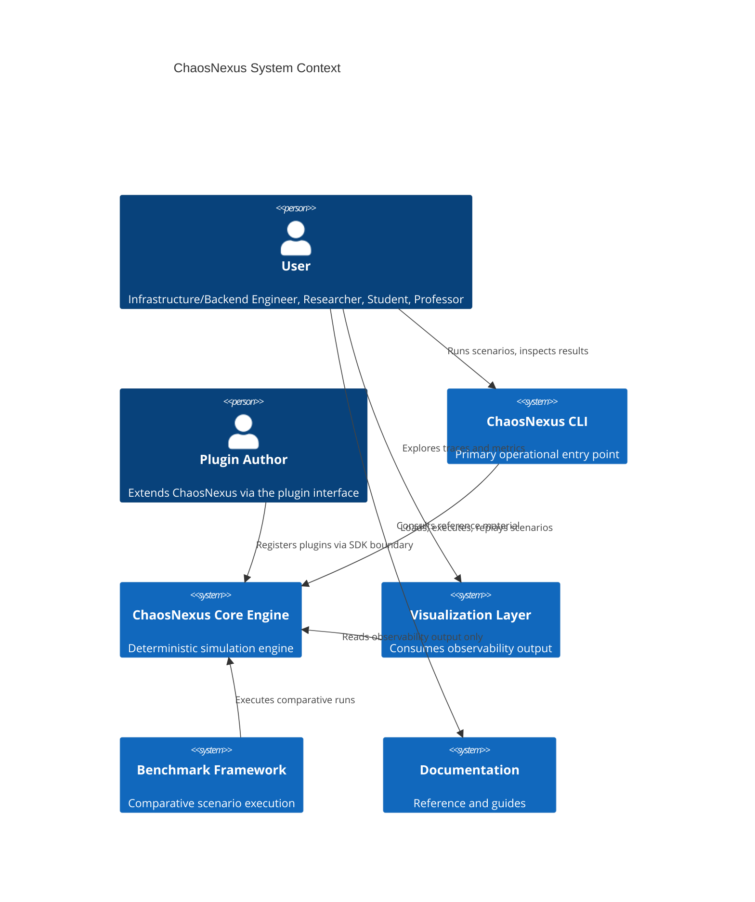
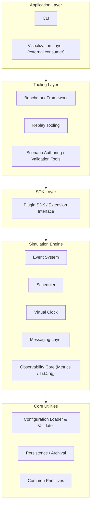
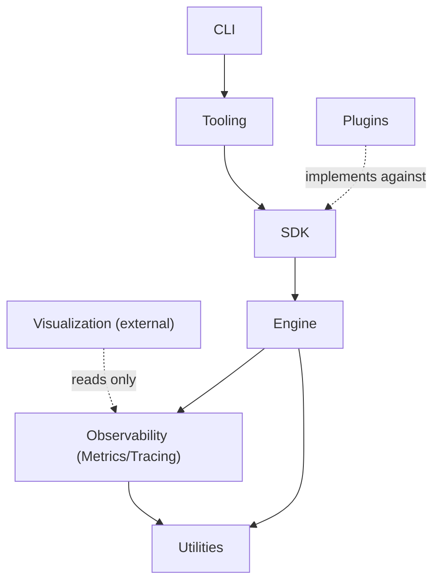
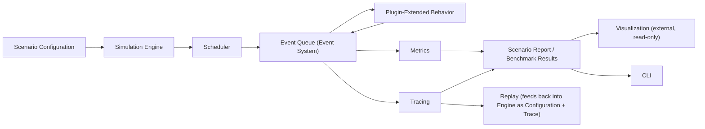
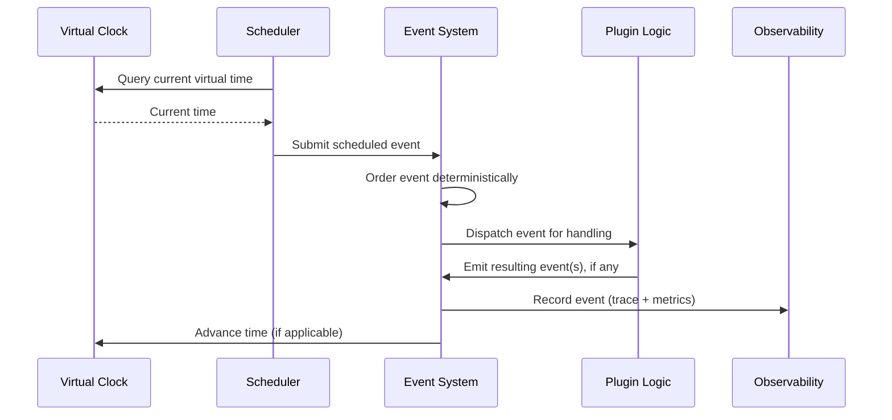
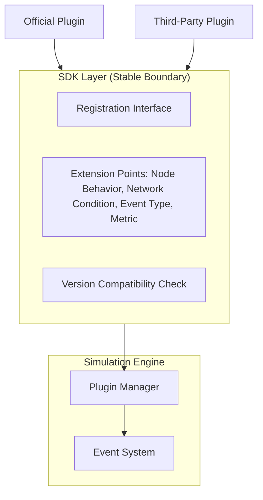
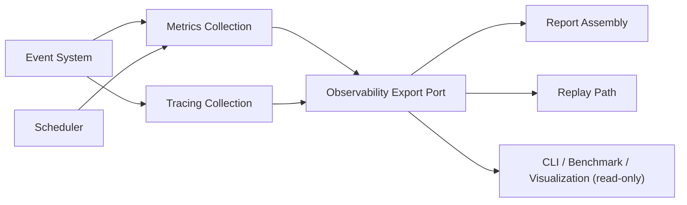
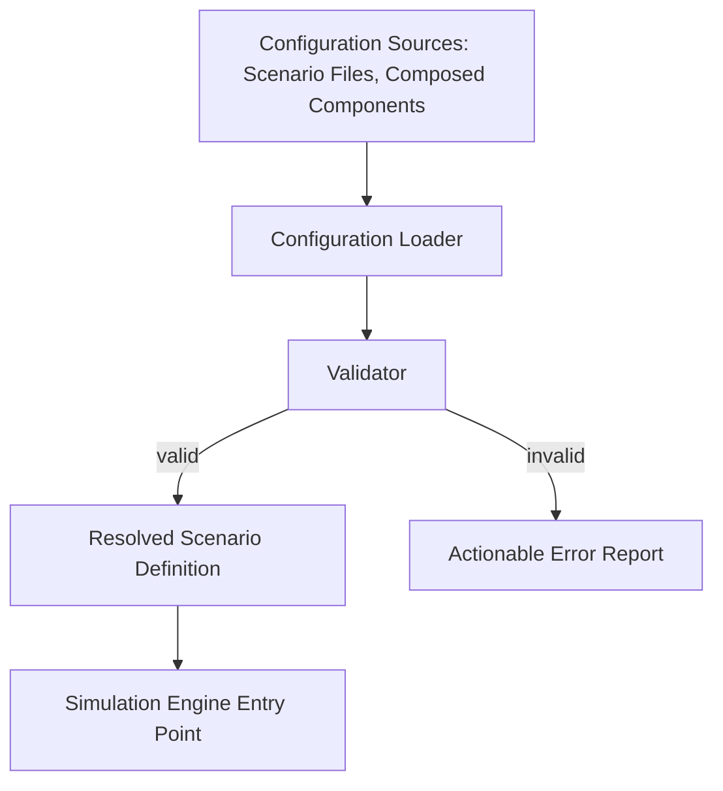

# ChaosNexus – Software Architecture Document (SAD)

## 1. Document Information

- **Title:** ChaosNexus Software Architecture Document
- **Document ID:** 03_SOFTWARE_ARCHITECTURE_DOCUMENT
- **Version:** 1.0
- **Status:** Draft — Pending Review
- **Organization:** ChaosNexus Engineering
- **Authors:** ChaosNexus Core Team
- **Last Updated:** 2026-07-09

---

## 2. Introduction

### 2.1 Purpose

This document defines the software architecture of ChaosNexus: the major subsystems, their responsibilities, the dependency rules between them, and the rationale behind each significant structural decision. It answers how the system will satisfy the requirements approved in `02_SOFTWARE_REQUIREMENTS_SPECIFICATION.md`, while remaining faithful to the mission and constraints of `00_PROJECT_CHARTER.md` and the long-term direction of `01_VISION.md`.

### 2.2 Scope

This document covers the high-level structure of ChaosNexus: architectural style, subsystem decomposition, layering, dependency direction, data and event flow, and the architectural treatment of cross-cutting concerns (observability, configuration, plugin extensibility). It does not define APIs, classes, namespaces, algorithms, memory layouts, or serialization formats — those belong to the Software Design Specification (Phase 5) and are explicitly out of scope here.

### 2.3 Intended Audience

Senior systems architects and engineers who will use this document as the structural foundation for detailed design. Reviewers are expected to evaluate this document for internal consistency, traceability to approved requirements, and long-term architectural soundness rather than implementation correctness.

### 2.4 Relationship with Previous Documents

Every subsystem, layer, and constraint introduced in this document is derived from one or more requirements in the SRS, which in turn trace to the Vision and Charter. Where this document makes a decision the SRS left open (e.g., the specific layering strategy), that decision is recorded in Section 19 with explicit rationale and trade-offs, not asserted without justification. No statement in this document contradicts a prior-phase document; where a tension exists between two requirements, it is surfaced in Section 18 (Architectural Risks) rather than silently resolved.

---

## 3. Architectural Goals

- **Preserve determinism as a load-bearing property.** The architecture must make it structurally difficult to introduce nondeterminism, not merely policy-discourage it (derived from FR-001, FR-002, NFR-007).
- **Make the plugin interface the primary extension mechanism.** New capabilities should be addable without core modification, for the lifetime of a major version (derived from FR-006, FR-025 through FR-030, NFR-009).
- **Keep the core engine technology- and consumer-agnostic.** The simulation engine must not know that a CLI, visualizer, or benchmark tool exists (derived from FR-059, FR-062, Section 8 of the SRS).
- **Treat observability as a structural output, not an afterthought.** Metrics, tracing, and reporting must be architected as first-class data flows out of the engine, not bolted onto it (derived from FR-040 through FR-050, NFR-010).
- **Bound complexity growth.** The architecture must resist accumulating layers or abstractions beyond what current approved requirements justify (derived from the SRS's Out-of-Scope section and the Charter's sustainable-growth philosophy).
- **Support a decade-long evolution path without premature commitment.** The architecture should accommodate future capabilities (Section 20) without requiring speculative structure today.

---

## 4. Architectural Drivers

The following requirements have outsized influence on architectural structure — meaning that satisfying them constrains the shape of the whole system, not just one subsystem:

- **Determinism (FR-001, FR-002, FR-033, NFR-007):** Forces a strict, single-threaded or controlled-concurrency execution model for simulation logic, and forbids any architectural component from introducing wall-clock or environment-dependent behavior into the simulation path.
- **Virtual Time (FR-012 through FR-015):** Requires a central time authority that all scheduling, messaging, and event-ordering components consult; no subsystem can maintain an independent notion of time.
- **Plugin Extensibility (FR-006, FR-025 through FR-030, NFR-009):** Requires a stable, narrow, versioned boundary between the core engine and everything that extends it — this single driver shapes the entire layering strategy (Section 7).
- **Non-Intrusive Observability (FR-040, FR-041, NFR-010):** Requires that observability be architected as a passive consumer of engine state, never a participant that can alter outcomes — this drives the data-flow direction described in Section 10.
- **Visualization-Neutral Core (FR-062):** Requires the core and CLI to have zero required dependency on any visualization or GUI technology, reinforcing the layered separation between simulation and presentation.
- **Testability (NFR-012):** Requires subsystem boundaries to be drawn such that each can be exercised and verified independently, influencing the granularity of subsystem decomposition in Section 8.
- **Compatibility and SDK Stability (NFR-013, FR-026):** Requires that the plugin-facing boundary be architecturally isolated from internal engine change, so that internal refactoring does not force plugin breakage within a major version.

---

## 5. Architectural Style

ChaosNexus adopts a combination of architectural styles, each addressing a distinct concern rather than being applied uniformly:

- **Layered Architecture** governs the overall system structure (Section 7), separating user-facing tooling from the simulation core. This directly supports FR-062 (visualization-neutral core) and the general principle of low coupling: a change in the CLI or visualization layer cannot ripple into the engine, and vice versa.
- **Event-Driven Architecture** governs the internal behavior of the simulation engine (Sections 10–11). Distributed-system simulation is intrinsically a sequence of discrete events; modeling the engine as an event-driven core is the most direct way to satisfy FR-007 (ordered event processing) and FR-047 (complete event tracing) without introducing artificial structure.
- **Plugin (Microkernel) Architecture** governs extensibility (Section 12). A small, stable core exposes narrow extension points; all optional or scenario-specific behavior lives outside the core. This is the most direct architectural response to the plugin-first constraint and to NFR-009.
- **Modular Monolith**, not a distributed or microservice architecture, is selected for the deployment shape of ChaosNexus itself. The system runs as a single process (per scenario execution) with well-separated internal modules. This is justified because: (a) the SRS explicitly excludes networked or cloud-hosted execution of the engine itself (SRS Section 17), (b) a single-process model is the simplest way to guarantee determinism (distributed coordination introduces exactly the kind of nondeterminism FR-001 forbids), and (c) internal modularity already satisfies NFR-003 (maintainability) without the operational cost of a distributed system.
- **Hexagonal (Ports-and-Adapters) framing** is applied specifically at the boundary between the simulation engine and everything external to it — CLI, visualization, persistence, benchmarking. The engine defines ports (observability export, configuration input, plugin extension); the CLI, visualization layer, and persistence mechanisms are adapters against those ports. This directly satisfies FR-059 (visualization data interface) and FR-062 (visualization-neutral core): the engine has no knowledge of which adapter, if any, is attached.

No microservice, actor-model, or distributed-systems style is adopted for ChaosNexus's own implementation, despite the system's subject matter being distributed systems. This distinction — simulating distributed behavior versus being architecturally distributed — is treated as a first-class design decision and is recorded in Section 19.

---

## 6. System Context

- **Users** interact primarily through the CLI (FR-055 through FR-058), which is the authoritative operational surface.
- **Plugin Authors** interact with the engine exclusively through the documented plugin boundary (Section 12); they never depend on engine internals.
- **The Visualization Layer** is a downstream, read-only consumer of observability data; it has no path to influence simulation execution (FR-059, FR-062).
- **The Benchmark Framework** is architecturally a specialized orchestrator of the CLI/engine execution path (FR-051 through FR-054), not a separate execution engine.
- **Documentation** is treated as a system-level output, produced alongside every public interface (NFR-011), rather than a separate downstream artifact.
- **Future Integrations** (e.g., a packaged SDK for third-party distribution, per SRS Section 13) attach at the same plugin and observability ports already defined; no new context-level relationship is anticipated without a corresponding requirement.

---

## 7. High-Level System Architecture

- **Application Layer:** The outermost, user-facing layer. The CLI is the primary member; the Visualization Layer is architecturally external to ChaosNexus proper — it is a consumer of the engine's observability ports and is not a required component of the system (FR-062).
- **Tooling Layer:** Higher-order operational capabilities built on top of the engine and SDK — benchmarking, replay orchestration, and scenario authoring aids. This layer exists so that these capabilities can evolve independently of both the CLI's presentation concerns and the engine's execution concerns.
- **SDK Layer:** The plugin interface boundary. This layer is deliberately thin: its sole responsibility is to expose engine extension points to plugin authors in a stable, versioned form (FR-025, FR-026, FR-029). It contains no simulation logic of its own.
- **Simulation Engine:** The deterministic core — event processing, scheduling, virtual time, messaging, and the observability data generated as a direct byproduct of execution. This is the only layer where determinism (NFR-007) must be enforced at the architectural level; every layer above it must be structurally incapable of feeding back into it in a way that would compromise that guarantee.
- **Core Utilities:** Configuration parsing/validation, persistence primitives, and common utilities shared across the engine. This layer sits "below" the engine in the diagram because the engine depends on it, not the reverse — configuration and persistence are services to the engine, not authorities over it.

Dependencies flow strictly downward. No lower layer depends on a higher layer under any circumstance (elaborated in Section 9).

---

## 8. Major Subsystems

### 8.1 Simulation Engine (Coordinator)
- **Purpose:** Owns the overall scenario lifecycle (FR-035) and coordinates the Event System, Scheduler, Virtual Clock, and Messaging Layer to produce a deterministic run.
- **Responsibilities:** Scenario loading handoff from Configuration, lifecycle state management (load → validate → execute → terminate → report), termination-condition evaluation (FR-004), and final report assembly (FR-038).
- **Dependencies:** Core Utilities (configuration, persistence primitives). Depended upon by: SDK Layer, Tooling Layer, Application Layer.
- **Interfaces:** Exposes a scenario-execution port to the SDK/Tooling layers; exposes an observability port (read-only) to any attached consumer.
- **Constraints:** Must remain the single source of truth for scenario state; must not depend on any subsystem above it in Section 7.

### 8.2 Event System
- **Purpose:** Maintains and processes the ordered stream of simulation events (FR-007 through FR-011).
- **Responsibilities:** Event ordering and causality preservation (FR-007, FR-008), support for plugin-defined event types (FR-009), and exposing event state for introspection (FR-011).
- **Dependencies:** Virtual Clock (for ordering), Core Utilities (common primitives).
- **Interfaces:** An event-submission port used by the Scheduler and Messaging Layer; an event-introspection port used by the Observability Core.
- **Constraints:** Must guarantee deterministic tie-breaking (FR-007's acceptance criteria); must not expose mutable references to pending events to any external consumer.

### 8.3 Scheduler
- **Purpose:** Determines the order and timing of simulated task execution (FR-016 through FR-019).
- **Responsibilities:** Applying the configured scheduling policy (FR-017), enforcing fairness guarantees where claimed (FR-018), and emitting scheduling-decision records to the Observability Core (FR-019).
- **Dependencies:** Virtual Clock, Event System.
- **Interfaces:** A policy-selection port consulted at scenario load time (driven by Configuration); a scheduling-decision output consumed by Observability.
- **Constraints:** Scheduling policy selection must be resolvable entirely from configuration (FR-017) without code change; must not introduce nondeterministic tie-breaking.

### 8.4 Virtual Clock
- **Purpose:** The single authority for simulated time (FR-012 through FR-015).
- **Responsibilities:** Maintaining a monotonically non-decreasing virtual clock, exposing configurable time granularity (FR-014), and providing a query interface for current virtual time (FR-015).
- **Dependencies:** Core Utilities only.
- **Interfaces:** A time-query port consulted by every other engine subsystem; no subsystem is permitted to maintain its own independent time source.
- **Constraints:** Must be the only component in the system permitted to advance simulated time; must have zero dependency on wall-clock APIs (FR-013).

### 8.5 Messaging Layer
- **Purpose:** Models message delivery between simulated nodes over a configurable virtual network (FR-020 through FR-024).
- **Responsibilities:** Applying configured network conditions (delay, loss, duplication, reordering — FR-021), modeling partitions (FR-022), and supporting plugin-defined message types (FR-023) without implicit delivery guarantees (FR-024).
- **Dependencies:** Virtual Clock, Event System.
- **Interfaces:** A message-send/deliver port used by scenario and plugin logic; network-condition configuration consumed from the Configuration subsystem.
- **Constraints:** Must not assume any delivery guarantee beyond what scenario configuration explicitly states.

### 8.6 Plugin Manager
- **Purpose:** Owns plugin registration, versioning, isolation, and discovery (FR-025 through FR-030).
- **Responsibilities:** Validating plugin interface-version compatibility before load (FR-026), isolating plugin failures from the core and other plugins (FR-027), and exposing a plugin-discovery query (FR-028).
- **Dependencies:** Core Utilities. Sits architecturally at the boundary between the SDK Layer and the Simulation Engine.
- **Interfaces:** A registration port used at scenario/process startup; a discovery port used by the CLI (FR-028 → FR-058).
- **Constraints:** Must not grant any plugin access beyond the documented SDK surface (FR-029); official plugins must go through the identical path as third-party plugins (FR-030).

### 8.7 Configuration System
- **Purpose:** Loads, validates, and resolves scenario configuration (FR-031 through FR-034).
- **Responsibilities:** Declarative scenario parsing, pre-execution validation with actionable errors (FR-032), reproducibility guarantees tied to resolved seeds (FR-033), and composition of reusable configuration components (FR-034).
- **Dependencies:** Core Utilities only.
- **Interfaces:** A configuration-resolution port consumed by the Simulation Engine at load time.
- **Constraints:** Must fully resolve a scenario before any simulation event is processed; must never allow partially-valid configuration to reach the engine (FR-032).

### 8.8 Metrics
- **Purpose:** Collects quantitative measurements of scenario execution (FR-043 through FR-046).
- **Responsibilities:** Built-in metric collection, plugin-defined metric extension (FR-044), cross-run aggregation (FR-045), and semantic stability of built-in metrics across versions (FR-046).
- **Dependencies:** Event System, Scheduler (as data sources); Core Utilities.
- **Interfaces:** A metrics-emission port used internally by engine subsystems and plugins; a metrics-export port consumed by CLI, Benchmark Framework, and Visualization.
- **Constraints:** Must not alter simulation state as a side effect of collection (FR-041).

### 8.9 Tracing
- **Purpose:** Records the complete event history of a scenario run (FR-047 through FR-050).
- **Responsibilities:** Full-fidelity event tracing sufficient for replay (FR-047), configurable trace granularity (FR-048), causal linkage for debugging (FR-049), and platform-neutral trace representation (FR-050).
- **Dependencies:** Event System, Virtual Clock.
- **Interfaces:** A trace-export port consumed by Persistence, Replay Tooling, and Visualization.
- **Constraints:** Must be non-intrusive (FR-041); trace completeness must be sufficient, on its own, to support deterministic replay (FR-036).

### 8.10 Benchmark Framework
- **Purpose:** Orchestrates comparative execution across configurations, plugin implementations, or scheduling policies (FR-051 through FR-054).
- **Responsibilities:** Fair-comparison enforcement (FR-053), batch execution across seeds/configurations (via the Tooling Layer's batch capability, FR-039), and structured result export (FR-054).
- **Dependencies:** Simulation Engine (via its execution port), Metrics.
- **Interfaces:** A benchmark-definition input; a comparative-results export using the same structured format as general metrics (FR-054).
- **Constraints:** Must not bypass the engine's standard execution path — a benchmark run is architecturally indistinguishable, from the engine's perspective, from an individually invoked scenario run.

### 8.11 CLI
- **Purpose:** The primary operational entry point for users (FR-055 through FR-058).
- **Responsibilities:** Scenario execution invocation, observability inspection commands, replay invocation, and plugin/scenario discovery.
- **Dependencies:** Simulation Engine's execution and observability ports, Plugin Manager's discovery port, Tooling Layer (Benchmark, Replay).
- **Interfaces:** The user-facing command surface; no other subsystem depends on the CLI.
- **Constraints:** Must have zero required dependency on the Visualization Layer (FR-062).

### 8.12 Visualization Integration
- **Purpose:** Defines the port through which an external visualization layer consumes observability data (FR-059 through FR-062); does not implement visualization itself.
- **Responsibilities:** Exposing timeline-reconstructable data (FR-060) and, where applicable, incremental data availability during long-running scenarios (FR-061).
- **Dependencies:** Metrics, Tracing (as data sources).
- **Interfaces:** A read-only observability export port; no inbound port from Visualization back into the engine exists.
- **Constraints:** The engine and CLI must build, run, and pass all tests with no visualization component present (FR-062).

---

## 9. Component Dependency Model

**Allowed dependencies:**
- Application Layer → Tooling Layer → SDK Layer → Simulation Engine → Core Utilities (strict downward chain).
- Any layer may depend on Core Utilities directly, since utilities are common primitives with no upward awareness.
- The Observability Core (Metrics, Tracing) is depended upon by every higher layer but itself depends only on the Engine subsystems that produce data (Event System, Scheduler) and Core Utilities.

**Forbidden dependencies:**
- The Simulation Engine (and everything within it: Event System, Scheduler, Virtual Clock, Messaging Layer) must never depend on the SDK Layer, Tooling Layer, or Application Layer. The engine has no knowledge that a CLI or visualizer exists (FR-062).
- Plugins must never depend on Simulation Engine internals directly; they depend only on the SDK Layer's exposed surface (FR-029).
- The Visualization Layer must never have a write or control path into the Simulation Engine; its relationship to Observability is read-only (FR-059).
- No subsystem within the Simulation Engine may depend on wall-clock time or any external environmental state (FR-013, NFR-007).
- Core Utilities must never depend on any subsystem above it — this would invert the entire layering model.

**Layer boundaries:** Each layer boundary in Section 7 corresponds to exactly one of the dependency rules above; a component is considered architecturally non-conformant if it violates its layer's allowed dependency set, regardless of whether the violation is convenient in the short term.

**Dependency rule rationale:** This strict, acyclic, downward-only structure is the direct architectural enforcement mechanism for NFR-009 (extensibility — nothing above the SDK layer can destabilize the engine) and FR-062 (visualization neutrality). A dependency cycle anywhere in this graph would be treated as an architectural defect requiring immediate remediation, not a style preference.

---

## 10. Data Flow

Configuration flows into the engine once, at load time, and is fully resolved before execution begins (FR-032). From that point, all data flow within the engine is event-driven: the Scheduler feeds the Event Queue, plugin-extended logic reacts to and emits further events, and the Event Queue is the single point from which both Metrics and Tracing derive their data — neither collects data through a separate path, which is what guarantees non-intrusiveness (FR-041). Reports are assembled from Metrics and Tracing without engine involvement beyond the export port. Replay is architecturally a re-entry into the same Configuration-to-Engine path, using an archived configuration and trace instead of one authored fresh (FR-036) — it is not a separate execution mode.

---

## 11. Event Flow

An event's lifecycle consists of four architectural stages: **scheduling** (the Scheduler determines when an event should occur, consulting the Virtual Clock), **ordering** (the Event System places it deterministically relative to other pending events, per FR-007), **dispatch** (the event is handed to the responsible built-in or plugin logic, per FR-009), and **recording** (the event and any causal effects are captured by Observability before the next event is processed, per FR-008 and FR-047). This sequence is identical regardless of whether the event originates from built-in engine logic or plugin-defined logic — architectural uniformity here is what makes FR-009 and FR-023 (extensible event and message types) satisfiable without special-casing.

---

## 12. Plugin Architecture

- **Plugin Lifecycle:** Discover → Register → Version-Check → Isolate → Activate. Registration (FR-025) and version compatibility checking (FR-026) occur before a plugin participates in any scenario; isolation (FR-027) is maintained for the plugin's entire active lifetime, not just at load.
- **Plugin Responsibilities:** A plugin implements one or more of the documented extension points (node behavior, network condition, event type, message type, metric) and declares its targeted SDK interface version. A plugin has no responsibilities toward, and no visibility into, the engine's internal state beyond what the SDK exposes.
- **Extension Points:** Defined narrowly and by capability (node behavior, network condition, event type, metric emission), consistent with FR-029's minimal-surface requirement. New categories of extension point are additive, not modifications to existing ones, to preserve NFR-013 (compatibility).
- **Isolation:** Enforced structurally by the Plugin Manager, which mediates all plugin interaction with the Event System and other engine subsystems — no plugin holds a direct reference to engine-internal state (FR-027).
- **Versioning Strategy:** Each plugin declares a target SDK interface version; the Plugin Manager rejects incompatible plugins before scenario execution begins (FR-026). Breaking changes to the SDK surface require a major version increment (NFR-013).
- **Discovery Mechanism:** The Plugin Manager exposes a query interface listing registered plugins and their declared capabilities, consumed by the CLI (FR-028, FR-058). Discovery is read-only and has no side effect on plugin state.
- **Official vs. Third-Party Plugins:** Architecturally indistinguishable — both pass through the identical SDK boundary (FR-030), which is the architecture's primary mechanism for validating that the SDK surface is genuinely sufficient rather than tailored to trusted-only use.

---

## 13. Observability Architecture

Observability is architected as a strictly passive, downstream consumer of engine execution — Metrics and Tracing observe the Event System and Scheduler but never inject data back into them (this is the structural guarantee behind FR-041's non-intrusiveness requirement). Both converge on a single Observability Export Port, which is the only sanctioned path by which any external consumer (CLI, Benchmark Framework, Visualization) retrieves scenario data (FR-040). Logging, in this architecture, is treated as a diagnostic subset of the same observability path rather than a parallel mechanism, avoiding a second, inconsistent channel for describing engine behavior. Replay is architected as consuming the same export (specifically, the Tracing output plus original Configuration) to re-enter the engine — it is not a separate observability concern but a reuse of the existing one. Storage formats for any of this data are explicitly deferred to the Software Design Specification.

---

## 14. Configuration Architecture

- **Configuration Sources:** Declarative scenario definitions, optionally composed from reusable, named components (FR-034), authored external to the engine.
- **Scenario Definitions:** Fully declarative; the architecture requires that any expressible scenario be constructible without code changes (FR-031), which is why Configuration is architected as a distinct subsystem below the engine rather than as engine-internal parsing logic — this keeps the declarative surface independently evolvable and testable (NFR-012).
- **Runtime Configuration:** Once resolved, configuration is treated as immutable input to a scenario run; the engine does not re-consult raw configuration sources mid-execution, which reinforces determinism (FR-033).
- **Validation Responsibilities:** All validation (missing fields, unresolved plugin references, malformed composition) occurs before the Resolved Scenario Definition is handed to the engine (FR-032); the engine is never responsible for defending against malformed configuration, only for consuming validated input.

---

## 15. Architectural Constraints

- **Engine cannot depend on visualization:** Preserves FR-062 and ensures the core's evolution is never coupled to presentation-layer technology choices.
- **Plugins cannot modify engine internals:** Preserves FR-027 and FR-029; without this, plugin isolation and SDK stability would be unenforceable.
- **Core remains technology agnostic (beyond the mandated language/build constraints):** Prevents the simulation core from acquiring incidental dependencies (e.g., on a specific persistence or visualization technology) that would compromise portability (NFR-004) and long-term maintainability (NFR-003).
- **Virtual time only:** The Virtual Clock is the sole time authority; this is what makes FR-001 (deterministic execution) architecturally achievable rather than merely aspirational.
- **No hidden shared mutable state:** Reinforced by the Plugin Manager's mediation of all plugin-engine interaction (FR-027) and by scenario state isolation (FR-003); any shared mutable state discovered outside a documented interface is an architectural defect.
- **Stable public SDK:** The SDK Layer's extension points may only grow additively within a major version (NFR-013); this is why the SDK is architected as a distinct, thin layer rather than a direct exposure of engine internals.
- **Deterministic execution:** The overriding constraint (NFR-007) to which every other constraint yields when a genuine conflict arises, as recorded in the SRS's risk register and reaffirmed in Section 18 below.

---

## 16. Cross-Cutting Concerns

- **Logging:** Treated as a diagnostic-severity subset of the Observability Export Port (Section 13), not a separate mechanism, to avoid divergent accounts of engine behavior.
- **Error Handling:** Configuration errors are surfaced before execution (FR-032); plugin errors are isolated and reported without corrupting engine or sibling-plugin state (FR-027); the engine fails predictably rather than exhibiting undefined behavior (NFR-005).
- **Configuration:** Centralized in the Configuration System (Section 14); no subsystem parses or interprets raw configuration independently.
- **Versioning:** Governed at the SDK boundary (FR-026, NFR-013); internal engine refactoring within a major version must never force plugin-facing version increments.
- **Diagnostics:** Derived from the same Tracing and Metrics data used for research and teaching purposes — there is no separate "debug-only" data path, which keeps debugging support (FR-049) consistent with production observability.
- **Testing:** Subsystem boundaries (Section 8) are drawn specifically to allow independent test harnesses per subsystem, in direct service of NFR-012; the strict dependency direction (Section 9) means lower layers can be tested with no dependency on higher-layer stubs.
- **Performance:** Addressed primarily through the Event System and Scheduler's internal efficiency (deferred to design) rather than through architectural shortcuts that would compromise determinism; where the two conflict, Section 18 documents the resolution.
- **Documentation:** Architected as an obligation attached to every SDK Layer and Application Layer interface (NFR-011); no subsystem is considered architecturally complete without a corresponding documentation artifact.
- **Security:** The Plugin Manager's isolation boundary (Section 12) is the primary architectural security control; the architecture does not assume configuration or plugin sources are adversarial beyond what NFR-008 requires, consistent with SRS Assumption A-4.
- **Portability:** Achieved by keeping the Simulation Engine and Core Utilities free of platform-specific dependencies; platform-specific concerns, if any, are pushed to the outermost (Application) layer.

---

## 17. Quality Attribute Realization

- **Performance (NFR-001):** Realized by keeping the Event System and Scheduler as the sole hot path, with Observability architected as a passive tap rather than an inline gate — avoiding unnecessary overhead in the execution path itself.
- **Maintainability (NFR-003):** Realized through strict layering (Section 7) and acyclic dependencies (Section 9), which bound the blast radius of any single change.
- **Scalability (NFR-002):** Realized by keeping the Event System and Messaging Layer free of architectural assumptions about scenario size; growth in node or event count is a data-volume concern for these subsystems, not a structural one.
- **Determinism (NFR-007):** Realized structurally through the single-authority Virtual Clock (Section 8.4), the single-threaded-or-controlled-concurrency execution model implied by the Modular Monolith style, and the exclusion of any wall-clock dependency from the Simulation Engine layer.
- **Observability (NFR-010):** Realized by making every engine subsystem a data source into a single Observability Export Port (Section 13), ensuring no functionally significant behavior is architecturally invisible.
- **Extensibility (NFR-009):** Realized through the microkernel-style Plugin Architecture (Section 12), which keeps the core minimal and pushes optional behavior outward.
- **Reliability (NFR-005):** Realized through Plugin Manager isolation (Section 8.6) and Configuration Validator's pre-execution rejection of malformed input (Section 14).
- **Portability (NFR-004):** Realized by confining any platform-specific concern to the Application Layer and keeping the Simulation Engine and Core Utilities platform-neutral.
- **Testability (NFR-012):** Realized by the subsystem granularity chosen in Section 8, each with a narrow, well-defined interface that can be exercised independently of the full system.

---

## 18. Architectural Risks

- **Plugin Complexity Growth:** As extension points accumulate, the SDK Layer risks becoming as complex as the engine itself, undermining its "thin boundary" intent. *Mitigation:* new extension-point categories require explicit justification against an approved requirement (per Section 4's driver-based approach), not speculative addition.
- **Performance Bottlenecks in the Event System:** As the sole hot path (Section 17), the Event System is the most likely site of a performance/determinism conflict. *Mitigation:* any proposed performance optimization must be evaluated against NFR-007 first; optimizations that cannot preserve exact determinism are rejected regardless of performance benefit, consistent with the SRS's risk resolution.
- **Over-Abstraction in Layering:** Five architectural layers (Section 7) risk introducing indirection with no corresponding benefit if a future capability doesn't need all of them. *Mitigation:* the Tooling Layer and SDK Layer are kept intentionally thin (Sections 8.10, 8.6) so that their overhead remains proportional to actual capability, not layering for its own sake.
- **Dependency Cycles:** The strict acyclic model (Section 9) is only as good as its enforcement. *Mitigation:* dependency direction should be verifiable by automated tooling introduced during the design phase; any detected cycle is treated as a defect, not a style violation to be discussed later.
- **Feature Creep via Benchmark/Visualization Integration:** Because Benchmark and Visualization are natural places to accumulate convenience features, there is a risk of these layers acquiring engine-like responsibilities over time. *Mitigation:* both are architecturally constrained to read-only consumption of the Observability Export Port (Sections 8.10, 8.12); any capability requiring write access to engine state must be re-scoped as a core or SDK concern instead.
- **SDK Stability Under Real Plugin Load:** The SDK's stability guarantees (NFR-013) are untested until real third-party plugins exist. *Mitigation:* official plugins are architecturally required to use the identical SDK boundary as third parties (FR-030), providing continuous internal validation that the boundary is sufficient before external plugins depend on it.

---

## 19. Architectural Decisions

**AD-1: Modular Monolith over Distributed/Microservice Architecture**
- **Decision:** ChaosNexus is implemented and deployed as a single process per scenario execution, internally modular but not distributed.
- **Rationale:** Distributed coordination between components would introduce exactly the class of nondeterminism (network timing, partial failure, ordering ambiguity) that the system exists to simulate, not experience. A single-process model is the most direct way to satisfy FR-001 and NFR-007.
- **Trade-offs:** Forgoes independent scaling or deployment of individual subsystems; accepted because the SRS explicitly excludes networked/cloud-hosted execution of the engine itself (SRS Section 17), making this cost moot against current requirements.
- **Related Requirements:** FR-001, FR-003, NFR-007, SRS §17.

**AD-2: Microkernel Plugin Architecture over Inheritance-Based or Compile-Time Extension**
- **Decision:** Extensibility is achieved through a runtime plugin boundary mediated by a Plugin Manager, rather than through compile-time extension or engine subclassing.
- **Rationale:** A runtime, mediated boundary is the only approach that satisfies FR-025 (registration without engine source modification) and FR-027 (isolation) simultaneously; compile-time extension would require rebuilding the engine per plugin, violating the plugin-first constraint.
- **Trade-offs:** Introduces a version-compatibility surface (FR-026) that must be actively maintained; accepted because the alternative (recompilation per extension) is incompatible with the ecosystem model in the Vision document.
- **Related Requirements:** FR-006, FR-025 through FR-030, NFR-009.

**AD-3: Hexagonal Boundary Between Engine and All External Consumers**
- **Decision:** CLI, Visualization, Benchmark, and Persistence are all architected as adapters against a small set of engine-defined ports (execution, observability export, plugin registration), rather than being given differentiated or privileged access.
- **Rationale:** This is the most direct way to guarantee FR-062 (visualization-neutral core) while still supporting FR-059 (visualization data interface) and FR-051 (benchmarking) — all three consumers are structurally equivalent from the engine's point of view.
- **Trade-offs:** Slightly constrains what any individual consumer (e.g., a future SDK) can do without a corresponding port being added; accepted because uniform treatment is what prevents any one consumer from acquiring engine-modifying capability by accretion.
- **Related Requirements:** FR-040, FR-059, FR-062, FR-051.

**AD-4: Single Time Authority (Virtual Clock) Consulted by All Subsystems**
- **Decision:** No subsystem other than the Virtual Clock may originate or advance a notion of simulated time.
- **Rationale:** Distributing time authority across subsystems would create the possibility of disagreement about ordering, directly threatening FR-001 and FR-007.
- **Trade-offs:** Introduces a shared dependency that every timing-sensitive subsystem must consult, which could become a contention point; accepted because the alternative — multiple time sources — is architecturally incompatible with determinism.
- **Related Requirements:** FR-012 through FR-015, FR-007.

**AD-5: Observability as a Passive, Non-Intrusive Downstream Consumer**
- **Decision:** Metrics and Tracing observe engine execution but have no path to influence it; they are architected as consumers of the Event System and Scheduler, never as participants in scheduling or event dispatch decisions.
- **Rationale:** This is the only arrangement that can satisfy FR-041 (non-intrusive observability) unconditionally — any two-way interaction between Observability and the execution path would risk observability-induced nondeterminism.
- **Trade-offs:** Limits certain potential optimizations (e.g., observability-informed scheduling) that are not currently required; accepted because no approved requirement calls for such optimization, and introducing it would violate FR-041.
- **Related Requirements:** FR-040, FR-041, FR-047.

---

## 20. Future Architectural Evolution

The following are architectural possibilities the current design does not foreclose, but none are commitments of this phase:

- **Distributed or Parallel Simulation Execution:** If a future requirement calls for simulating substantially larger topologies, the Modular Monolith decision (AD-1) would need to be revisited — likely via a deterministic parallel-execution model (e.g., deterministic replay of parallel schedules) rather than a shift to genuinely distributed, nondeterministic coordination, to preserve NFR-007.
- **Cloud-Hosted Batch Execution:** The Tooling Layer's batch and benchmark capabilities (Sections 8.10, FR-039) could be extended to orchestrate many independent, still-deterministic single-process runs across cloud infrastructure, without requiring the engine itself to become distributed.
- **Additional Plugin Categories:** New extension-point categories (e.g., new failure-condition types) can be added additively at the SDK Layer without disturbing the layering model, provided each is justified against an approved requirement as described in Section 18's mitigation for plugin complexity growth.
- **Advanced Visualization:** Because Visualization is already architected as a read-only adapter against the Observability Export Port (AD-3), richer visualization capability (e.g., live timeline scrubbing) is achievable by extending that port's data richness (building on FR-060, FR-061) without any change to the engine's internal architecture.
- **Large-Scale Benchmarking:** The Benchmark Framework's current fair-comparison model (FR-053) could extend to larger comparative studies (more configurations, more seeds) purely by scaling the Tooling Layer's orchestration, with no architectural change to the engine.

---

## 21. Architecture Summary

ChaosNexus's architecture is organized as a strictly layered system — Application, Tooling, SDK, Simulation Engine, and Core Utilities — with dependencies flowing in one direction only, from user-facing concerns down toward the deterministic core. The core itself is event-driven, governed by a single virtual-time authority, and structurally incapable of depending on anything above it, which is what makes the charter's determinism and plugin-first commitments architecturally enforceable rather than merely documented. Extensibility is achieved through a microkernel-style plugin boundary that keeps the core minimal and treats official and third-party plugins identically. Observability is architected as a passive, non-intrusive downstream consumer of engine execution, feeding CLI, benchmarking, and an entirely optional, decoupled visualization layer through a uniform export port. Every subsystem, layer boundary, and constraint in this document traces to one or more requirements approved in the SRS, and every significant trade-off — most centrally, determinism over performance and over architectural distribution — is resolved consistently in determinism's favor, in direct continuity with the Project Charter's founding priorities. This structure is intended to remain stable for a decade of evolution: growth is expected to occur by extension at the SDK and Tooling layers, not by renegotiating the boundaries established here.
