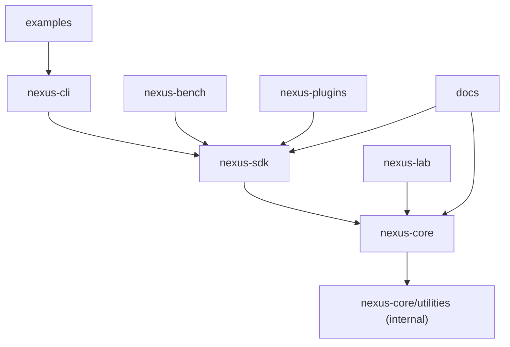
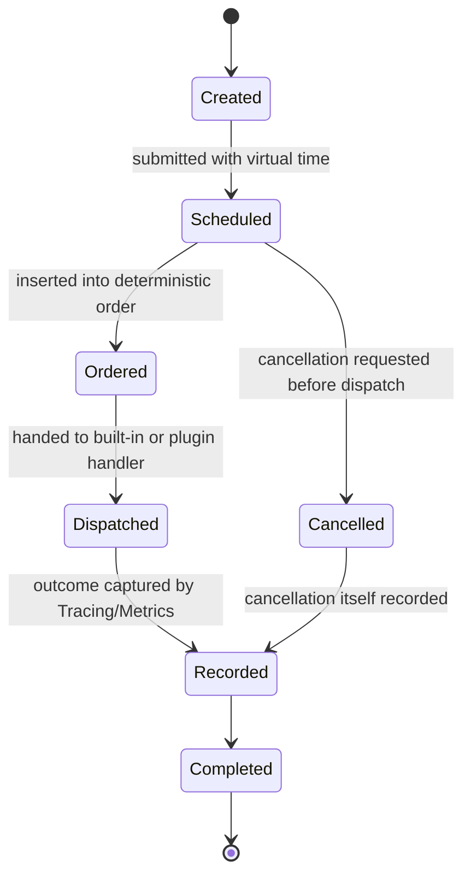
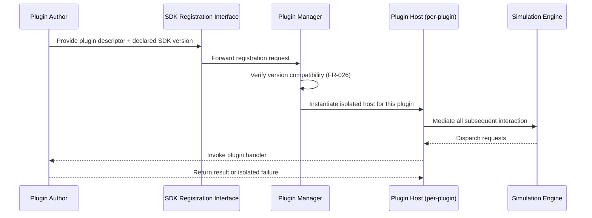
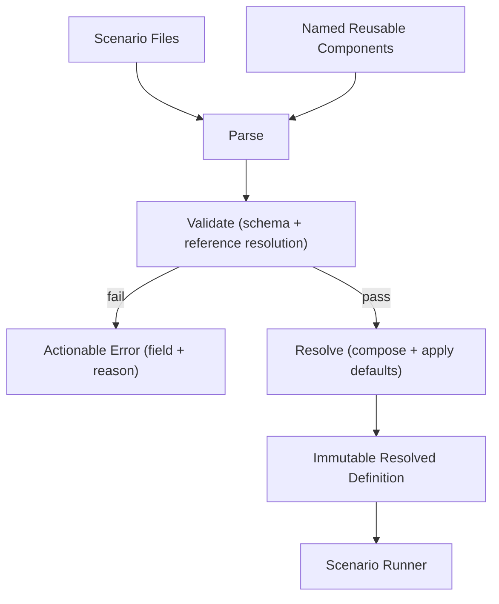

# ChaosNexus – Software Design Specification (SDS)

## 1. Document Information

- **Title:** ChaosNexus Software Design Specification
- **Document ID:** 04_SOFTWARE_DESIGN_SPECIFICATION
- **Version:** 1.0
- **Status:** Draft — Pending Review
- **Organization:** ChaosNexus Engineering
- **Authors:** ChaosNexus Core Team
- **Last Updated:** 2026-07-09

---

## 2. Introduction

### 2.1 Purpose

This document refines the architecture approved in `03_SOFTWARE_ARCHITECTURE_DOCUMENT.md` into a design detailed enough that implementation can begin directly from it. It specifies subsystem responsibilities, interfaces (in terms of information flow and ownership, not signatures), lifecycle rules, error-handling strategy, and the design patterns expected to appear in the codebase — without writing code, defining classes, or specifying algorithms.

### 2.2 Scope

This document covers the internal design of every subsystem identified in the Software Architecture Document (Section 8 of that document): the Simulation Engine and its constituents (Event System, Scheduler, Virtual Clock, Messaging Layer), the Plugin Manager, Configuration System, Metrics, Tracing, Benchmark Framework, CLI, and the Visualization Integration boundary. It also covers repository organization, object-lifetime strategy, error handling, testing philosophy, and cross-cutting design concerns. It does not cover concrete APIs, class hierarchies, header layout, algorithms, or serialization formats — those are implementation-phase concerns.

### 2.3 Intended Audience

Senior C++ engineers, systems engineers, architects, and open-source contributors who will use this document as the direct basis for implementation and code review.

### 2.4 Relationship to Previous Documents

Every design decision in this document traces to a specific architectural decision (`AD-#`) or requirement (`FR-#`/`NFR-#`) from the prior two phases. Where the architecture left a design choice open — for example, exactly how plugin isolation is enforced, or which design patterns realize the microkernel boundary — this document makes that choice explicitly, with rationale, rather than leaving it for ad hoc resolution during implementation. Nothing here redefines an architectural boundary; where a design consideration seems to press against one (see Section 21), it is flagged as a risk rather than resolved by quietly reinterpreting the architecture.

---

## 3. Design Goals

- **Make determinism a property of the design, not a discipline required of implementers.** Ownership and interaction rules should make it difficult to accidentally introduce nondeterminism (realizes AD-4, NFR-007).
- **Keep the SDK surface small and independently stable.** The plugin-facing design should be reviewable and versionable on its own, separate from internal engine design churn (realizes AD-2, NFR-013).
- **Favor explicit ownership over implicit lifetime management.** Every piece of state should have one clearly identified owner (realizes the Charter's no-hidden-shared-state constraint and NFR-003).
- **Prefer composition and narrow interfaces over deep inheritance hierarchies.** This keeps subsystems independently testable (NFR-012) and avoids the kind of coupling that historically makes simulation engines difficult to extend.
- **Design for the decade, not the demo.** Where a simpler design and a more "impressive" one both satisfy current requirements, this document chooses the simpler one, consistent with the Charter's sustainable-growth philosophy and the Architecture Document's rejection of speculative structure.

---

## 4. Repository Design

- **nexus-core:** The Simulation Engine and Core Utilities layers from the architecture (Event System, Scheduler, Virtual Clock, Messaging Layer, Metrics, Tracing, Configuration, common primitives). This repository has no dependency on any other ChaosNexus repository — it is the dependency root.
- **nexus-sdk:** The SDK Layer. Contains the plugin extension-point definitions and the Plugin Manager's public-facing registration and discovery surface. Depends only on `nexus-core`. This repository's stability is governed independently (Section 12) because it is the contract third parties build against.
- **nexus-cli:** The Application Layer's CLI. Depends on `nexus-sdk` (for plugin discovery) and transitively on `nexus-core` (for execution and observability). Contains no simulation logic of its own.
- **nexus-bench:** The Benchmark Framework (Tooling Layer). Depends on `nexus-sdk` and the execution/observability ports it exposes. Kept as a separate repository so its release cadence and dependencies (e.g., statistical or reporting libraries) don't burden `nexus-core`.
- **nexus-lab:** The reference implementation of a Visualization consumer. Depends only on `nexus-core`'s observability export (read-only), never on `nexus-sdk`'s registration surface, since visualization does not register plugins.
- **nexus-plugins:** The collection of official plugins. Depends only on `nexus-sdk`, using the identical boundary available to third parties (per AD-2 and FR-030) — this repository exists specifically to keep that claim continuously verified.
- **examples:** Example scenario configurations and minimal usage walkthroughs; depends on `nexus-cli` conceptually (examples are meant to be run through it) but contains no library code of its own.
- **docs:** Documentation sourced from and validated against the above repositories; not a dependency of any of them, per NFR-011's requirement that documentation accompany, not follow, interface introduction.

This decomposition mirrors the architecture's layering (Section 7 of the SAD) at the repository boundary, making the dependency rules in SAD Section 9 mechanically enforceable — a repository cannot accidentally depend "upward" if the upward repository doesn't exist in its build graph.

---

## 5. Internal Module Design

### 5.1 Core (nexus-core root)
- **Responsibility:** Owns scenario lifecycle coordination (SAD 8.1) and composes the engine's constituent subsystems.
- **Public responsibilities:** Exposes the scenario-execution entry point and the observability export port to `nexus-sdk` and beyond.
- **Internal responsibilities:** Sequencing subsystem initialization, propagating the resolved configuration to each subsystem, and assembling the final scenario report.
- **Dependencies:** Configuration, Event System, Scheduler, Virtual Clock, Messaging Layer, Metrics, Tracing, Utilities.
- **Extension points:** None directly — Core composes subsystems but does not itself expose plugin extension points (those belong to the subsystems that plugins actually extend).
- **Design constraints:** Must not import anything from `nexus-sdk`, `nexus-cli`, or `nexus-bench` (AD-3 hexagonal boundary; SAD Section 9 forbidden dependencies).

### 5.2 Simulation Module
- **Responsibility:** The coordinating logic described in SAD 8.1, distinct from Core in that Core is the composition root and Simulation is the lifecycle state machine (load → validate → execute → terminate → report, FR-035).
- **Dependencies:** Configuration (input), Event System and Scheduler (drive execution), Metrics and Tracing (report assembly).
- **Extension points:** Termination-condition evaluation is pluggable in the sense that scenario configuration selects among documented conditions (FR-004); this is a configuration-driven point, not a plugin-code extension point.
- **Design constraints:** Must expose its current lifecycle stage for external inspection (SAD FR-035 acceptance criteria) without exposing mutable internal state.

### 5.3 Event System Module
- **Responsibility:** Deterministic event ordering, causality tracking, and event-type extensibility (SAD 8.2).
- **Dependencies:** Virtual Clock (ordering authority).
- **Extension points:** Plugin-defined event types (FR-009) register a handling contract with this module through the SDK, but the module itself has no compile-time knowledge of any specific plugin-defined type.
- **Design constraints:** Must not expose mutable references to pending events outside its own processing loop (SAD 8.2 constraint); external consumers may only read completed, recorded events via Tracing.

### 5.4 Scheduler Module
- **Responsibility:** Applies the configured scheduling policy, enforces fairness where claimed, and emits scheduling decisions (SAD 8.3).
- **Dependencies:** Virtual Clock, Event System.
- **Extension points:** Scheduling policy is selected by name from configuration (FR-017); a fixed, documented set of built-in policies is provided. Whether third-party scheduling policies are plugin-extensible is a question deferred to the SDK's initial extension-point catalog (Section 12) rather than assumed here.
- **Design constraints:** Must produce identical scheduling decisions given identical configuration and seed (NFR-007); must not query wall-clock time under any circumstance.

### 5.5 Virtual Clock Module
- **Responsibility:** Sole authority for simulated time (SAD 8.4, AD-4).
- **Dependencies:** None beyond Utilities.
- **Extension points:** None. This module is intentionally closed to extension — allowing plugins to influence time progression would violate AD-4.
- **Design constraints:** Every other module that needs "the current time" queries this module; no module may cache or independently derive a time value that could drift from it.

### 5.6 Messaging Module
- **Responsibility:** Virtual network modeling — delivery, delay, loss, duplication, reordering, and partitioning (SAD 8.5).
- **Dependencies:** Virtual Clock, Event System.
- **Extension points:** Plugin-defined message types (FR-023) and, where documented, custom network-condition models.
- **Design constraints:** Must not assume any delivery guarantee not explicitly configured (FR-024); must express all network effects as scheduled events, not as direct, out-of-band function calls, so that Tracing captures them uniformly.

### 5.7 Plugin Manager Module
- **Responsibility:** Registration, version compatibility, isolation, and discovery (SAD 8.6).
- **Dependencies:** Utilities; mediates access to Event System, Scheduler, and Messaging Module on behalf of plugins.
- **Extension points:** This module *is* the extension-point gateway; it does not itself have further extension points.
- **Design constraints:** No plugin may hold a direct reference to another module's internal state; all plugin interaction is mediated through interfaces this module issues (Section 12).

### 5.8 Configuration Module
- **Responsibility:** Loading, validating, and resolving scenario definitions (SAD 8.7).
- **Dependencies:** Utilities only.
- **Extension points:** Configuration schema composition (FR-034) allows named, reusable components; whether plugins can contribute new configuration schema fragments is addressed in Section 13.
- **Design constraints:** Must fully validate before any other module observes the configuration (FR-032); must treat a resolved configuration as immutable for the remainder of the run (FR-033).

### 5.9 Metrics Module
- **Responsibility:** Quantitative measurement collection, plugin-extensible metrics, cross-run aggregation (SAD 8.8).
- **Dependencies:** Event System, Scheduler (as data sources).
- **Extension points:** Plugin-defined metrics (FR-044), registered through the same interface as built-in metrics.
- **Design constraints:** Must never write back to any module it observes (FR-041); collection must be read-only with respect to simulation state.

### 5.10 Tracing Module
- **Responsibility:** Full-fidelity, replay-sufficient event history (SAD 8.9).
- **Dependencies:** Event System, Virtual Clock.
- **Extension points:** Trace granularity is configuration-selected (FR-048); no plugin-code extension point is needed since tracing already captures plugin-defined event types uniformly (by virtue of Event System design, Section 5.3).
- **Design constraints:** Must be sufficient, together with original configuration, to support deterministic replay (FR-036) without any additional side-channel data.

### 5.11 Benchmark Module (nexus-bench)
- **Responsibility:** Comparative execution orchestration and fair-comparison enforcement (SAD 8.10).
- **Dependencies:** The Simulation Module's execution entry point (via SDK), Metrics.
- **Extension points:** Benchmark definitions are configuration, not code; no plugin-code extension point is introduced here.
- **Design constraints:** Must invoke scenario execution through the identical path used by direct CLI invocation — no privileged or shortcut execution path (SAD AD-3).

### 5.12 CLI Module (nexus-cli)
- **Responsibility:** User-facing command surface (SAD 8.11).
- **Dependencies:** SDK's execution, observability, and discovery ports.
- **Extension points:** None — the CLI is a consumer, not an extension point provider.
- **Design constraints:** Must build and operate with zero dependency on any visualization technology (FR-062).

### 5.13 Utilities Module
- **Responsibility:** Common primitives shared across `nexus-core` (e.g., result/error types, identifier types, common collection helpers referenced conceptually, not concretely, in this document).
- **Dependencies:** None — this is the dependency floor.
- **Extension points:** None.
- **Design constraints:** Must remain free of any dependency on simulation semantics; a utility that becomes simulation-aware belongs in a different module.

---

## 6. Component Design

This section describes cross-module components whose behavior spans the modules in Section 5.

### 6.1 Scenario Runner (spans Simulation, Configuration, Event System, Scheduler)
- **Purpose:** The end-to-end orchestrator of a single scenario execution, from resolved configuration to final report.
- **Responsibilities:** Sequencing subsystem initialization in dependency order (Virtual Clock → Event System → Scheduler → Messaging → Metrics/Tracing), driving execution until a termination condition is met, and delegating report assembly.
- **Inputs:** A fully resolved, validated scenario configuration (never a raw or partially validated one) and a resolved random seed.
- **Outputs:** A scenario report (FR-038) and the accompanying trace and metrics artifacts.
- **Lifecycle:** Constructed fresh per scenario execution; never reused or pooled across runs, which is the simplest way to guarantee FR-003 (isolated scenario state) without introducing explicit reset logic.
- **Ownership:** Owns the subsystem instances for the duration of one run; subsystem instances do not outlive the Scenario Runner that created them.
- **Dependencies:** All Simulation Engine modules (Section 5.2–5.6).
- **Failure scenarios:** Configuration resolution failure (halts before any subsystem is constructed); a plugin failure isolated by the Plugin Manager (run continues with the failure recorded, per FR-027, unless the scenario's termination policy treats it as fatal); an internal consistency violation (e.g., an ordering invariant break) which is treated as a fatal, immediately-reported defect rather than something to recover from silently.

### 6.2 Replay Runner (spans Tracing, Configuration, Scenario Runner)
- **Purpose:** Re-executes a previously completed scenario from archived configuration and trace (FR-036).
- **Responsibilities:** Loading archived configuration and trace, verifying their mutual consistency (e.g., matching scenario/version identifiers), and re-invoking the Scenario Runner with identical inputs.
- **Inputs:** Archived configuration, archived seed, archived trace (used for verification, not as an alternate execution path).
- **Outputs:** A fresh scenario report that must match the archived one exactly.
- **Lifecycle:** Constructed on demand for a single replay invocation.
- **Ownership:** Does not own the archived data long-term; that belongs to Persistence.
- **Dependencies:** Configuration Module, Tracing Module, Scenario Runner.
- **Failure scenarios:** Version incompatibility between the archived trace format and the current build (surfaced as a clear, actionable error rather than a silent best-effort replay); mismatch between replayed and archived outcomes (treated as a fatal defect requiring investigation, since it indicates a determinism violation).

### 6.3 Plugin Host (spans Plugin Manager, Event System, Messaging, Metrics)
- **Purpose:** The runtime mediator through which a loaded plugin's code is invoked and through which its effects are attributed and isolated.
- **Responsibilities:** Dispatching events, messages, or metric-emission calls to plugin-provided handlers; catching and isolating plugin-originated failures (FR-027); attributing plugin activity in Tracing without granting the plugin direct access to the Tracing module.
- **Inputs:** Registered plugin handler references (obtained at registration time), dispatch requests originating from Event System/Messaging/Metrics.
- **Outputs:** Plugin-produced events, messages, or metrics, re-injected into the owning module through the same path as built-in producers.
- **Lifecycle:** One Plugin Host instance per registered plugin, created at registration and destroyed at scenario teardown; never shared across scenario runs, reinforcing FR-003.
- **Ownership:** Owns the boundary/adapter state needed to isolate a given plugin; does not own the plugin's own internal state, which is the plugin author's responsibility.
- **Dependencies:** Plugin Manager (creates it), Event System/Messaging/Metrics (dispatch targets).
- **Failure scenarios:** A plugin handler throwing or otherwise failing is caught at this boundary and reported as an isolated failure (FR-027); a plugin attempting to access state outside its granted interface is structurally prevented rather than merely detected, per the SDK's minimal-surface design (Section 12).

---

## 7. Interface Design

Interfaces are described here by responsibility and information flow, not by method signature.

- **Configuration → Simulation:** Flows a single, fully resolved and validated scenario definition, once, at scenario start. Ownership of the resolved definition transfers to the Simulation Module for the run's duration; Configuration retains no further authority over it (supports FR-033's reproducibility guarantee — nothing can mutate the definition mid-run).
- **Virtual Clock → {Scheduler, Event System, Messaging, Tracing}:** Flows a read-only "current virtual time" query, consulted whenever any of these modules needs to timestamp or order an action. No information flows in the other direction except a scheduler-issued "advance time" request, which is the only way virtual time may progress (reinforces AD-4).
- **Scheduler → Event System:** Flows scheduling decisions (what should run, and when, in virtual time). Event System owns subsequent ordering and dispatch; the Scheduler does not retain control over an event once submitted.
- **Event System → Plugin Host → Plugin Code:** Flows an event dispatch request; plugin code returns resulting events or an isolated failure signal. The Event System does not know the plugin's internal representation, only the Plugin Host's mediated contract.
- **{Event System, Scheduler} → {Metrics, Tracing}:** Flows a one-way stream of completed, immutable event and decision records. Metrics and Tracing own their own copies/derived views of this data; they never hold a reference back into live engine state (this is the structural basis for FR-041's non-intrusiveness).
- **{Metrics, Tracing} → Observability Export Port → {CLI, Benchmark, Visualization}:** Flows read-only, structured observability data. Consumers own their own copies once retrieved; there is no live, mutable handle into engine state exposed across this boundary (reinforces FR-062 and AD-3).
- **CLI → Simulation (via SDK):** Flows an execution request (resolved configuration reference) and, later, retrieval requests for report/metrics/trace data. The CLI owns the user-facing session; it does not own or outlive the Scenario Runner it invoked.
- **Benchmark → Simulation (via SDK), Metrics:** Flows multiple execution requests (one per compared configuration) and aggregates their Metrics output; Benchmark does not intervene in any individual run's execution.

Across all these interfaces, information flows are designed to be **one-directional and ownership-transferring or read-only** — never shared-mutable — which is the interface-level realization of the Charter's no-hidden-shared-state constraint.

---

## 8. Object Lifetime Strategy

- **RAII Philosophy:** All engine-owned resources (subsystem instances, plugin host adapters, archived-data handles during replay) are scoped to a well-defined lifetime boundary — principally the Scenario Runner's lifetime for anything created to serve a single run. Nothing is designed to require explicit, manual teardown ordering by a caller; construction order implies teardown order in reverse.
- **Smart Pointer Usage Policy:** Ownership is expressed, not implied. A module that uniquely owns a resource for its own lifetime uses unique-ownership semantics; a resource whose lifetime must be shared across more than one owning context (expected to be rare, and limited to genuinely shared, immutable data such as a resolved configuration referenced by both Simulation and Tracing) uses shared, reference-counted ownership. Non-owning observation (e.g., a module reading Virtual Clock's current time) is expressed as a non-owning reference, never as shared ownership, to avoid obscuring the true owner.
- **Stack vs. Heap Allocation Strategy:** Short-lived, function-local data (e.g., an in-progress validation result) is stack-allocated. Anything whose lifetime spans multiple stages of the scenario lifecycle (subsystem instances, the event queue's contents, accumulated trace records) is heap-allocated with clear, single ownership as above. This distinction is a design-time policy; concrete allocation strategy (e.g., pooling for performance) is deferred to implementation, provided it does not compromise the ownership model.
- **Resource Ownership:** Each module in Section 5 owns exactly the state described in its "Responsibility" — no module reaches into another's internal state directly; all cross-module access happens through the flows described in Section 7.
- **Lifetime Boundaries:** The Scenario Runner (Section 6.1) is the primary lifetime boundary for a single execution. Configuration and Utilities have a lifetime that may span multiple scenario runs (e.g., a loaded plugin registry persisting across a batch of runs), but any run-scoped state they hand to a Scenario Runner is treated as owned by that runner for the run's duration, never mutated externally while a run is in progress.

---

## 9. Event System Design

- **Event Creation:** Events are created either by the Scenario Runner (e.g., scenario start/end markers), the Scheduler (task-execution events), the Messaging Module (message delivery events), or plugin code via the Plugin Host. Regardless of origin, every event carries the same minimal, uniform envelope (a virtual timestamp and a causal-predecessor reference) so downstream handling never special-cases origin.
- **Scheduling:** An event is scheduled by submitting it, with its intended virtual time, to the Event System; the Event System does not decide *when* an event should occur (that is the Scheduler's or Messaging Module's responsibility) — it only guarantees deterministic ordering once submitted (FR-007).
- **Processing:** Events are dispatched strictly in deterministic order; dispatch hands control to the responsible handler (built-in or, via the Plugin Host, plugin-defined) and blocks further dispatch until that handler completes, preserving causality (FR-008).
- **Completion:** An event is considered complete once its handler has returned and any resulting events it produced have themselves been submitted (not yet processed) into the Event System.
- **Replay:** Because every event's envelope and outcome are captured by Tracing (Section 5.10), replay reconstructs the identical Created → Dispatched → Recorded sequence from archived data, driving the same handlers rather than replaying recorded outcomes as a substitute for execution — this is what allows replay to also serve as a determinism check (FR-036, Section 6.2).
- **Cancellation:** A scheduled-but-not-yet-dispatched event may be cancelled (e.g., a message delivery cancelled by a subsequent partition event); cancellation is itself recorded as an event outcome, never as a silent removal, so that Tracing's history remains complete (FR-047).

---

## 10. Virtual Time Design

- **Time Progression:** Virtual time advances only in response to the Scheduler's explicit request to advance to the next event's scheduled time; it never advances as a function of wall-clock elapsed time (FR-013).
- **Scheduling Relationship:** The Scheduler consults Virtual Clock before making any scheduling decision and is the only module permitted to request an advance; the Event System and Messaging Module consult Virtual Clock read-only, to timestamp and order, never to advance it.
- **Time Ownership:** Virtual Clock (Section 5.5) is the sole owner of the current virtual time value; no other module stores or caches a duplicate copy that could drift.
- **Deterministic Guarantees:** Given identical scheduled inputs, virtual time advances through the identical sequence of values on every run, on every supported platform (NFR-004, NFR-007) — this module has no internal state that varies based on execution environment.

---

## 11. Scheduler Design

- **Responsibilities:** Deciding what simulated task executes next and at what virtual time, applying the scenario-configured policy (FR-017), and emitting the resulting scheduling decisions to Metrics/Tracing (FR-019).
- **Interaction with Virtual Time:** The Scheduler queries the current virtual time before each decision and is the sole originator of "advance to next time" requests to the Virtual Clock (Section 10).
- **Event Ordering Guarantees:** The Scheduler's decisions feed the Event System's deterministic ordering (Section 9); the Scheduler itself must resolve any policy-level ambiguity (e.g., two tasks nominally due at the same virtual time) using a documented, deterministic tie-breaking rule, never an unspecified one.
- **Priority Handling:** Where a scheduling policy defines priority (e.g., priority-based over FIFO), priority is expressed as data attached to a schedulable unit, interpreted by the selected policy — priority is not hard-coded into the Scheduler's core dispatch logic, keeping FR-017's policy-selection requirement satisfiable without Scheduler modification.
- **Execution Boundaries:** The Scheduler decides *order*, never *content* — it has no knowledge of what a scheduled task does internally; that remains the responsibility of the task's own handler (built-in or plugin-provided, via the Plugin Host).

---

## 12. Plugin System Design

- **Plugin Lifecycle:** Descriptor submission → version verification → host instantiation → active participation in scenario runs → teardown at scenario end. A plugin does not persist state across scenario runs unless it does so entirely within its own externally-owned storage — the framework guarantees no engine-side state persists for a plugin between runs (reinforcing FR-003).
- **Registration:** A plugin registers a descriptor (declared capabilities: node behavior, network condition, event type, message type, metric) and its targeted SDK interface version, through the SDK's registration interface (Section 5.1 of the SDK boundary), never by direct instantiation inside engine code.
- **Discovery:** The Plugin Manager exposes a read-only query surface listing currently registered plugins and their declared capabilities (FR-028), consumed by the CLI (FR-058); discovery never triggers plugin code execution.
- **Loading:** "Loading" in this design means descriptor verification and Plugin Host instantiation — it does not imply dynamic binary loading versus static linking, which is an implementation-phase decision left open here provided the isolation and versioning guarantees (below) hold either way.
- **Isolation:** Enforced by routing all plugin interaction through a per-plugin Plugin Host (Section 6.3); a plugin failure is caught at the Host boundary and reported without corrupting Engine state or other plugins' Hosts (FR-027).
- **Version Compatibility:** Verified once, at registration, against the SDK's declared interface version; incompatible plugins are rejected before any scenario execution begins (FR-026), with a clear, actionable error rather than a best-effort partial load.
- **Extension Philosophy:** The SDK's extension-point catalog (node behavior, network condition, event type, message type, metric) is deliberately fixed and small at this design stage; new categories are added only when a corresponding approved requirement justifies them (SAD Section 18 mitigation), not speculatively.

---

## 13. Configuration Design

- **Configuration Hierarchy:** A scenario definition may reference zero or more named, reusable components (FR-034); components themselves cannot reference a scenario, avoiding cyclic composition. Component resolution happens entirely before validation completes.
- **Validation:** Schema conformance and reference resolution (e.g., a referenced plugin capability must correspond to something the Plugin Manager reports as registered) are both checked before any value reaches the engine (FR-032). Validation failures report the offending field and reason, never a generic failure.
- **Loading:** Configuration sources are read once per scenario invocation; the Configuration Module does not watch for or react to source changes mid-run, which would violate FR-033.
- **Runtime Behavior:** Once resolved, the definition is treated as immutable input data, not as a live object the engine continues to consult — this removes an entire class of potential nondeterminism (a scenario behaving differently if its backing file changed mid-run).
- **Defaults:** Built-in defaults apply only where a scenario omits an optional field; defaults are documented as part of the schema (NFR-011) so their application is never a surprise to the scenario author.
- **Overrides:** Scenario-level values always take precedence over component-supplied ones, and command-line/CLI-supplied overrides (e.g., an explicit seed) take precedence over file-supplied values — a single, documented precedence order, not an implicit one.
- **Plugin-Contributed Schema:** Whether plugins may extend the configuration schema itself (as opposed to being *referenced* from configuration) is left as an open design question for the SDK's initial release; the safer default assumed here is that plugins declare their own configuration sub-schema, validated by the Plugin Manager on the plugin's behalf, rather than the core Configuration Module needing plugin-specific knowledge.

---

## 14. Error Handling Strategy

- **Invalid Configuration:** Detected and rejected entirely before scenario execution begins (FR-032); treated as a recoverable, user-correctable condition — the process does not need to terminate, only the specific scenario invocation fails with an actionable message.
- **Plugin Failures:** Isolated at the Plugin Host boundary (Section 6.3); by default, a plugin failure is recorded as a scenario-level anomaly rather than silently ignored, and whether it is treated as fatal to the run is itself a scenario-level policy choice (consistent with FR-004's configurable termination conditions), not a hard-coded engine behavior.
- **Simulation Errors:** A distinguishable category from plugin failures — e.g., an internal invariant violation in the Event System or Scheduler. These are treated as fatal defects: the run terminates immediately with full diagnostic context, since continuing past a broken invariant would risk silently invalidating determinism guarantees (NFR-007).
- **Internal Inconsistencies:** Any detected violation of an architectural guarantee (e.g., an event dispatched out of causal order, a replay producing a different outcome than its archived original) is treated as the most severe error category — logged with maximum diagnostic detail and never suppressed or retried automatically, since retrying could mask a genuine determinism defect.
- **Recoverable Failures:** Configuration errors and (by scenario policy) isolated plugin failures; the design goal is that these never require restarting the whole process, only correcting and re-invoking.
- **Fatal Failures:** Internal inconsistency and simulation-error categories; the design goal here is fast, loud failure with maximum diagnostic output rather than degraded continued operation, consistent with NFR-005's "predictable failure" requirement.

This tiered strategy is intentionally different from a single generic exception/error-code approach: the severity categories above are a design decision meant to make it obvious, at the point of handling, whether continuation is ever appropriate.

---

## 15. Logging and Diagnostics

- **Logging Responsibilities:** Logging is designed as the human-readable, severity-tagged projection of the same Observability Export Port used for Metrics and Tracing (SAD Section 13) — there is no separate, independently-implemented logging subsystem with its own view of engine state.
- **Diagnostic Information:** Any fatal failure (Section 14) carries enough context — current virtual time, the event or decision in progress, and the relevant subsystem — to be diagnosable from the log/trace output alone, without attaching a debugger.
- **Metrics:** As designed in Section 5.9; diagnostics may consult the same metrics stream but do not require a parallel diagnostic-only metrics path.
- **Tracing:** As designed in Section 5.10 and Section 9; the primary source of ground truth for both debugging and replay.
- **Replay Support:** Because Tracing is designed to be replay-sufficient (Section 9), a failure investigation can always fall back to replaying the exact run rather than relying on log narrative alone.
- **Debugging Philosophy:** Prefer reconstructable, data-driven debugging (replay + trace inspection) over ad hoc, print-statement-style debugging; this is both a design and a cultural expectation for contributors, consistent with the Charter's engineering-rigor emphasis.

---

## 16. Testing Design

- **Unit Testing:** Each module in Section 5 is designed with narrow, mockable dependencies (per its listed "Dependencies") specifically so it can be unit-tested in isolation — e.g., the Scheduler can be tested against a fake Virtual Clock and fake Event System without instantiating the full engine.
- **Integration Testing:** The Scenario Runner (Section 6.1) is the natural integration-test seam — a full scenario, run end-to-end against a minimal built-in scenario configuration, exercises the real interaction of all Simulation Engine modules.
- **Determinism Testing:** A first-class, explicitly named test category (not folded into general integration testing) that runs the same scenario/seed combination repeatedly, and across supported platforms, verifying byte-identical trace output — this directly operationalizes FR-001's and NFR-007's acceptance criteria.
- **Regression Testing:** Archived scenario/trace pairs (Section 6.2's Replay Runner) double as regression fixtures — a change that alters a previously-archived trace's outcome without an accompanying, documented version increment is treated as a regression.
- **Performance Testing:** Kept structurally separate from correctness/determinism testing, since the two can be in tension (SAD Section 18); performance tests measure throughput and resource usage against representative scenarios without asserting on exact trace content.
- **Benchmark Validation:** The Benchmark Module's fair-comparison guarantee (FR-053) is itself testable by asserting that only the intended varying configuration element differs across compared runs — a dedicated validation category distinct from general benchmarking usage.

---

## 17. Performance Design

- **Scalability:** The Event System and Messaging Module are designed around a single, uniform event envelope (Section 9) specifically so that growth in event volume is a matter of data volume, not structural complexity — no special-casing is needed as scenarios grow (NFR-002).
- **Memory Efficiency:** Event and trace records are designed as immutable, append-only data once recorded (Sections 9–10), which avoids the overhead and hazard of in-place mutation tracking; concrete memory layout is deferred to implementation.
- **Cache Friendliness:** Favoring append-only, sequentially-produced records (events, trace entries) over widely-scattered mutable object graphs is a design-level bias toward cache-friendly access patterns, though specific data structure choices are implementation concerns.
- **Minimal Allocations:** The design's preference for stack allocation of short-lived data (Section 8) and clear single ownership (avoiding incidental copies across the interfaces in Section 7) is intended to keep the eventual allocation profile predictable; specific pooling or arena strategies are left to implementation, provided they don't compromise the ownership model.
- **Efficient Event Processing:** Kept possible by design because Observability (Metrics/Tracing) is a passive, one-way consumer (Section 7) rather than an inline participant in the dispatch path — the hot path (Scheduler → Event System → Handler) has no required synchronous round-trip through Observability.

---

## 18. Security Considerations

- **Plugin Trust Model:** Consistent with SRS Assumption A-4 and NFR-008, plugins and configuration are assumed to come from a semi-trusted source; the Plugin Host's isolation (Section 6.3) protects against *accidental* plugin misbehavior (bugs, unhandled exceptions) but is not designed as a defense against a deliberately adversarial plugin author. This boundary is documented explicitly so it is never assumed to be stronger than it is.
- **Input Validation:** Configuration validation (Section 13) is the primary input-validation surface; it is designed to reject malformed input before it can reach any module that assumes well-formed data, avoiding the need for defensive validation scattered throughout the engine.
- **Configuration Validation:** As above — centralized, not distributed, so there is exactly one place trust boundaries around configuration are enforced.
- **Safe Defaults:** Where configuration omits an optional value (Section 13), the applied default is always the more conservative option (e.g., no implicit network reliability guarantee, per FR-024) rather than the more permissive one.

This design deliberately avoids over-engineering a sandboxing or capability-security model beyond what NFR-008 requires; a stronger trust boundary (e.g., true sandboxed plugin execution) is noted as a possible future evolution (Section 21) rather than built prematurely.

---

## 19. Design Patterns

- **Strategy:** Used for Scheduler policy selection (FR-017) and for pluggable network-condition behavior in the Messaging Module — both are cases of selecting among interchangeable algorithms/behaviors at configuration time without changing the surrounding module.
- **Microkernel / Plugin Pattern:** The overarching pattern for the entire SDK boundary and Plugin Manager (Section 12), directly realizing AD-2. This is not "a" pattern applied incidentally — it is the architecture's central extensibility mechanism.
- **Observer (one-way, non-intrusive variant):** Used for the relationship between the Event System/Scheduler and Metrics/Tracing (Section 7) — observers receive a one-way stream of completed records and have no path to influence the subject, a deliberately restricted variant of the classic pattern chosen specifically to preserve FR-041.
- **Adapter:** Used at every boundary described by AD-3 (Section 6 of the SAD) — CLI, Benchmark, and Visualization each adapt the engine's execution/observability ports to their own consumer-specific needs, rather than the engine exposing consumer-specific interfaces.
- **Builder:** Used conceptually in Configuration resolution (Section 13) — composing a scenario definition from named components and defaults is a builder-style incremental assembly process, ending in an immutable, resolved result.
- **Command (implicit, for scheduled tasks):** A scheduled unit of work (Section 9) is conceptually a command object: it carries enough information to be executed once, deterministically, at its designated virtual time, decoupling "what should happen" (produced by Scheduler/plugin logic) from "when it is invoked" (decided by the Event System's ordering).

**Patterns deliberately not adopted:** A general-purpose Dependency Injection framework is not adopted; module dependencies (Section 5) are few enough and stable enough that explicit, constructor-level composition (via the Scenario Runner, Section 6.1) is simpler and equally testable, avoiding the indirection cost of a DI container for a system whose dependency graph is intentionally small and acyclic (SAD Section 9). A Composite pattern for scenario topology is not adopted at this design stage since no current requirement calls for recursively nested scenario structures.

---

## 20. Cross-Cutting Concerns

- **Logging:** As designed in Section 15 — a projection of the unified Observability Export Port, not a separate subsystem.
- **Metrics:** As designed in Section 5.9 and Section 7 — passive, one-way, plugin-extensible.
- **Configuration:** As designed in Section 13 — centralized validation and resolution, immutable thereafter.
- **Versioning:** Enforced at exactly two points: the SDK's plugin-version compatibility check (Section 12) and the Configuration/Trace format's version tagging (implied by Replay Runner's verification step, Section 6.2) — versioning is not scattered informally across modules.
- **Diagnostics:** As designed in Section 15 — replay-first, data-driven.
- **Portability:** Achieved by design through the Utilities module (Section 5.13) being the only place any platform-sensitive primitive is defined; all other modules depend on Utilities' abstractions rather than platform APIs directly.
- **Testing:** As designed in Section 16 — narrow dependencies per module enabling isolated testing, plus dedicated determinism and regression categories.
- **Documentation:** Every module's "Public responsibilities" (Section 5) and every cross-module interface (Section 7) is designed as a documentation obligation at the point of introduction, not a follow-up task, per NFR-011.

---

## 21. Design Risks

- **Excessive Abstraction in the SDK Boundary:** A too-generic extension-point design (Section 12) risks becoming as complex as the engine itself. *Mitigation:* the extension-point catalog is fixed and small at this design stage; growth requires justification against an approved requirement (same discipline as SAD Section 18).
- **Plugin Complexity via the Plugin Host:** Because the Plugin Host (Section 6.3) mediates all plugin interaction, it risks becoming a "God object" if new mediated capabilities are added carelessly. *Mitigation:* the Plugin Host's responsibilities are scoped per-plugin and per-capability (node behavior, network condition, event type, message type, metric); a new capability should extend this list explicitly, not generalize the Host into an all-purpose proxy.
- **Dependency Growth in nexus-bench and nexus-lab:** Because these repositories are free to add their own third-party dependencies (Section 4), there's a risk of dependency bloat that indirectly pressures `nexus-core` to accommodate them. *Mitigation:* the repository design's one-directional dependency rule (Section 4) structurally prevents `nexus-core` from ever depending on anything introduced by `nexus-bench` or `nexus-lab`.
- **Performance Overhead from Isolation:** Plugin Host mediation and one-way Observability recording (Sections 6.3, 7) both introduce indirection that could cost performance. *Mitigation:* both are designed as data-flow indirection, not synchronous control-flow overhead where avoidable; where a genuine conflict between isolation/observability and performance arises, determinism and isolation take precedence, consistent with the architecture's established resolution (SAD Section 18).
- **API Instability During Early SDK Iteration:** Before the SDK stabilizes (pre-1.0), rapid iteration on extension points could churn plugin code repeatedly. *Mitigation:* Section 12's fixed initial catalog and the requirement (FR-030) that official plugins use the same boundary as third parties should surface instability early, against official plugins, before external plugin authors are affected.
- **Replay Verification Becoming a Bottleneck:** If regression testing (Section 16) relies heavily on archived trace comparison, a growing archive could become expensive to validate on every change. *Mitigation:* left as an open implementation-phase concern (e.g., selective or sampled regression validation), noted here rather than resolved, since it doesn't require a design-level decision at this stage.

---

## 22. Implementation Readiness

**What has been designed:** Every subsystem identified in the Software Architecture Document now has a corresponding module or component design (Sections 5–6) with explicit responsibilities, dependencies, ownership rules, and failure-handling behavior. Interaction between subsystems is specified in terms of information flow and ownership (Section 7), object lifetime rules are established (Section 8), and the event, time, and scheduling models are specified conceptually but completely enough to guide concrete data-structure and algorithm choices (Sections 9–11). The plugin system's lifecycle, isolation, and versioning model is fully specified at the design level (Section 12), as is configuration handling (Section 13), error-handling severity tiers (Section 14), observability/diagnostics philosophy (Section 15), testing categories (Section 16), and the specific design patterns expected to appear in the codebase (Section 19), each justified against an architectural decision rather than adopted by default.

**What remains intentionally unspecified:** Concrete APIs, class names, namespaces, header organization, algorithms (e.g., the specific data structure backing the Event System's ordering), serialization/storage formats for configuration and trace data, memory layout and allocation strategy beyond the stack/heap policy in Section 8, and network-protocol-level detail for any future distributed tooling (Section 20 of the SAD). These are deliberately left open for the Implementation Guide and subsequent engineering work, where they can be decided with full knowledge of the target language version, build tooling, and performance measurements — none of which should be prematurely constrained by this document.

**Sufficiency for implementation:** A developer beginning implementation from this document has: a fixed module boundary and dependency graph (Sections 4–5) that will not need architectural renegotiation; explicit ownership and lifetime rules (Section 8) that resolve the majority of "who owns this" questions before they arise in code review; a settled error-handling taxonomy (Section 14) to implement against rather than invent ad hoc; and a small, justified set of design patterns (Section 19) that constrains implementation choices without dictating class-level structure. This is assessed as sufficient to begin implementation; anything not covered here is, by design, an implementation-phase decision rather than a gap in this specification.
